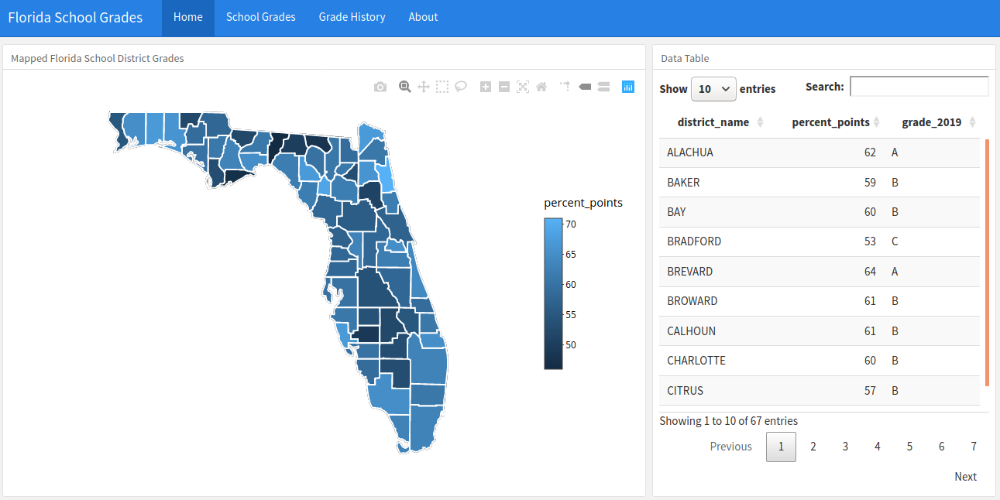

<!-- README.md is generated from README.Rmd. Please edit that file -->

```{r, include = FALSE}
knitr::opts_chunk$set(
  collapse = TRUE,
  comment = "#>"
)
```

# Florida School Grades


The goal of project is to demonstrate how to use Shiny & Rmarkdown to make large spreadsheets files interactive and easier to navigate.   



### R Libraries needed

* flexdashboard
* tidyverse
* ggmap
* plotly
* httr
* readxl
* janitor
* maps
* shiny


### Getting Started

* Open the file florida_school_grades.Rmd and select Run Document or Ctr+Shift+K


### Creator of the Application:

[Kevin Gilds, MPA](https://kgilds.rbind.io/) is a nonprofit professional working in the Tampa area. 


### Source:

This application pulls district and school grades from spreadsheet files on the [Florida Department of Education Website](http://www.fldoe.org/accountability/accountability-reporting/school-grades/)

School grades percentages are the on the following scale:

* A = 62% of points or higher

* B = 54%-61% of points

* C = 41%-53% of points

* D = 32%-40% of points

* F = 31% or less of points. 


For more information about how Florida School Grades are calculated: [Methodology](http://www.fldoe.org/core/fileparse.php/18534/urlt/SchoolGradesCalcGuide19.pdf)


